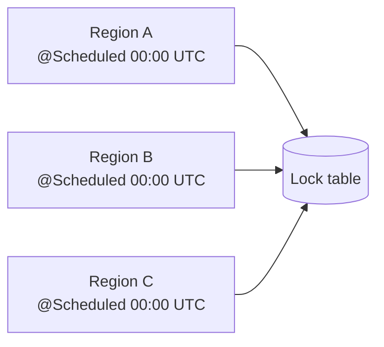
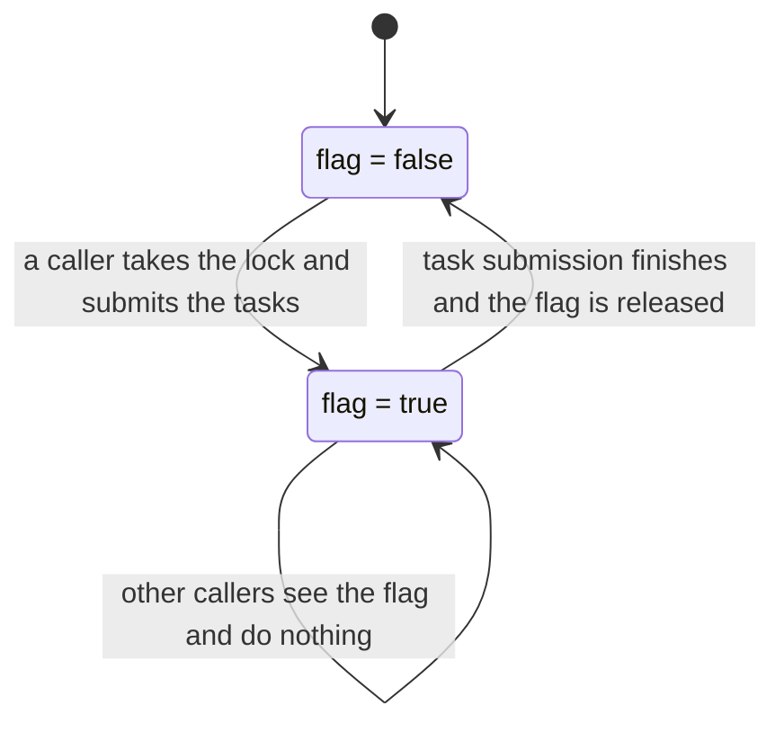
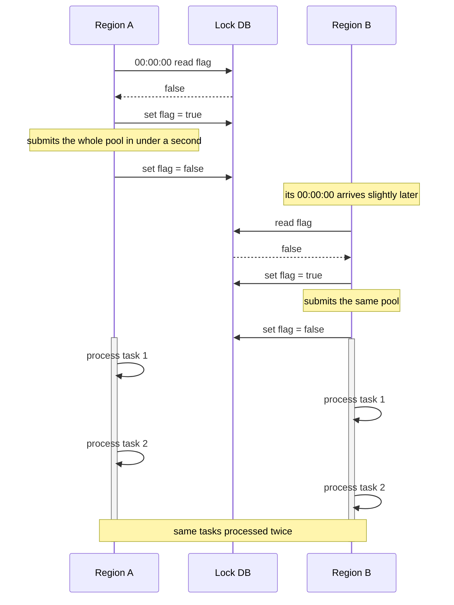
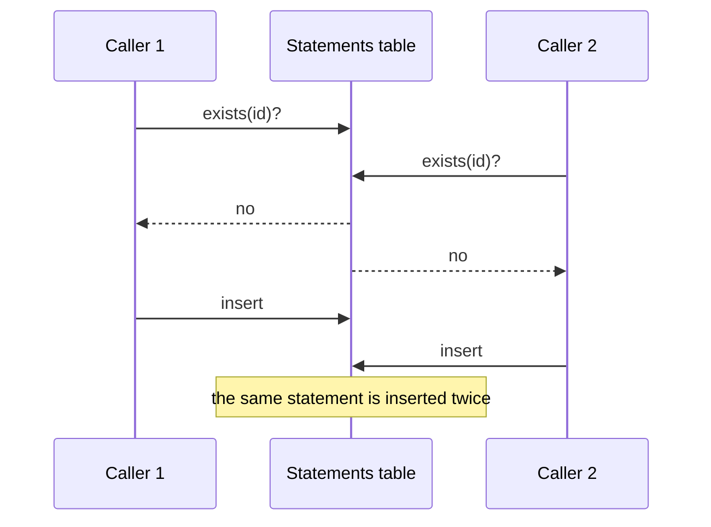
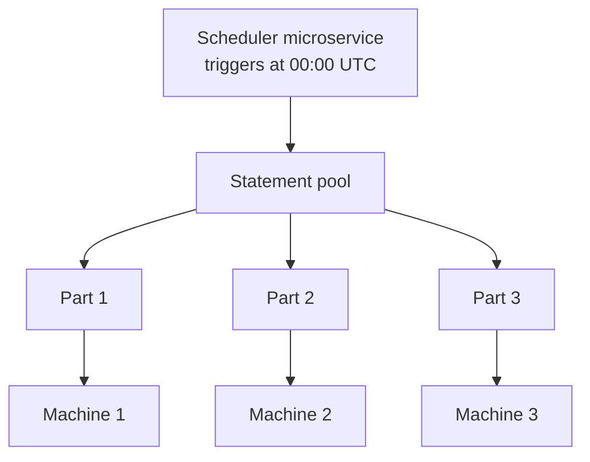
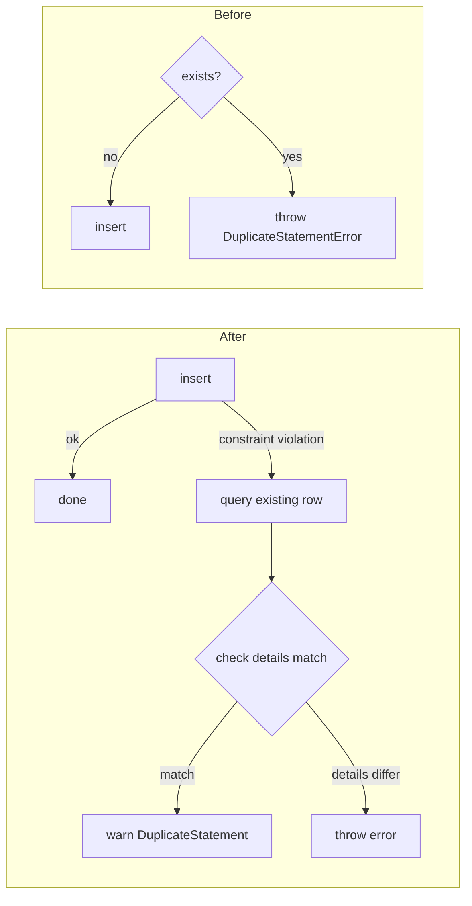
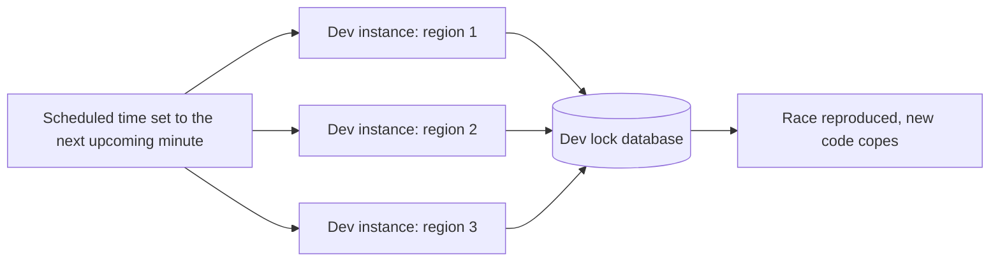
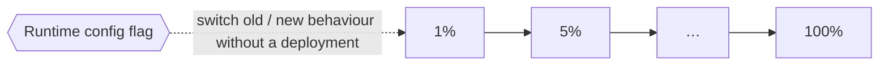

# Incident: A distributed lock that doesnt work

## Introduction



One of our daily jobs ran in several regions at once, and a lock was supposed to make sure that only one of them did the work. Occasionally, it didn't. This is the description of what was happenening.

**Note: everything below is severely simplified pseudocode, written to show the idea rather than the real implementation.**

## Context

The pool of statements has to be processed every day at 00:00 UTC. In some cases the whole run needs to finish within a minute. Each region has the same Spring `@Scheduled` job, set to the same nominal time, so the only thing preventing them from all doing the same work is the lock.

### How the lock worked



The lock itself follows a simple distributed lock design, the lock lives in a separate database, with one row for each recurring job:

| lock_id | name | flag | status    | ... |
|---|---|------|-----------|-----|
| 123 | statement process | true | submitted | ... |

```java
void getLockAndProcess(lockId, taskFunc) {
    lock = query(lockId);
    if (!lock.flag) {
        obtainLock()   // sets flag to true
        taskFunc();
        releaseLock    // sets flag to false
    }
}
```

The intention is that if several callers fire the same task at the same moment, only one of them gets through, and the flag is released when the work is done.

### How it was used

```java
@Scheduled(00:00 UTC)
void processAllTasks() {
    getLockAndProcess(lockId, this::submitTasks);
}

void submitTasks() {
    for (id : statementIds)                  // unique ids, so unique statements
        submitAsync(processStatement(id));   // submit statement process async task
}

# when statement is being processed, a query and insert would be done.
void insertStatement(statement) {
    if (query(statement.id) doesnt exist)
        insert(statement);
    else
        throw DuplicateStatementError;   // shouldn't happen: one machine owns the pool
}
```

The `else` branch in `insertStatement` rests on an assumption. Since only one machine is supposed to touch the pool, finding a statement that already exists would mean something had gone seriously wrong, so the code treats it as an error.

## What went wrong

At some point we began to see exactly those duplicate-statement errors. It indicated that statements were being inserted twice, which meant the lock was failing somewhere.

### Root cause

The distributed lock had been designed with long-running tasks in mind. Our job was a different case since all we needed was to submit the tasks for further processing. The whole thing was frequently processed in under a second, which led to the following sequence as seen relative to the lock database:



1. Region A reaches its own 00:00:00 UTC and takes the lock.
2. Region A submits the entire pool and releases the lock.
3. Region B reaches its own 00:00:00 UTC slightly later. Small differences between the machines' clocks, the timing of the scheduler and the physical distance between regions all add up, so a delay of a second or milliseconds is quite plausible. By then, the flag is clear again.
4. Region B takes the lock, submits the same pool and releases the lock.
5. Region A & B now are processing the same pool asynchronously

And sometimes both regions happen to process the same task, and performs `insertStatement` to the same statement database. This would also cause
insert race conditions.



The DB then handles the duplicate insert gracefully by throwing a SQLIntegrityConstraintViolationException. 

## The fix

### What I proposed



The cleaner solution, in my view, was to remove the lock entirely, along with the dependence on each machine's own clock. Instead we rely on a scheduler microservice, a dedicated central service whose job is to trigger and coordinate background and cron tasks across other services, and it seemed the natural thing to have it hand out the work at 00:00 UTC. Because it would only ever distribute a single pool, there would be no opportunity for duplicates. It would also give us a sensible route to larger pools, since the service could divide the pool into smaller parts and give each to a different machine, either by region or according to load.

### What I shipped in the meantime



The proposal was a fairly large change, and it wasn't something I could finish properly within my placement since my contract was ending. Hence, I described it in the system-analysis document and provided a temporary solution.
First I simply stopped the duplicates from throwing errors as it wasnt having any real business impact. I then adopted a insert first design for when the optimal solution would be implemented.

```java
void insertStatement(statement) {
    try {
        insert(statement);                       // insert first
    } catch (SQLIntegrityConstraintViolationException e) {
        existing = query(statement.id);
        checkDetailsMatch(statement, existing);  // e.g. currency amounts
        warn(e);                                 // warning, not error
    }
}
```

There were a 2 reasons for use this, the pool itself was fairly small and the later solution would eliminate duplicates. Here are the comparisons between the two:

| Approach | When to use | Reason                                                                                                                        |
|---|---|-------------------------------------------------------------------------------------------------------------------------------|
| Insert first | The probability of duplicates is very small | Almost every insert is required, so the lookup query should be used rarely.                                                   |
| Query, then insert | The probability of duplicates is high | Duplicates can be mostly caught with a fast query (on an indexed database), so they are eliminated cheaply before the insert. |

Whichever approach is used, remember that neither one makes the operation idempotent on its own. The database must have a unique key constraint configured, because that constraint is what actually guarantees duplicates cannot get in.

## Testing



Alongside the usual unit tests or integration tests etc, I wanted to see the problem happen for real, so I recreated it in the dev environment. I started instances in several different regions and set the scheduled time to the next upcoming minute, so that they would all fire together. That reproduced the multi-region race well enough, and I could watch the new code cope with it.

## Release



The release followed our normal process, with a safety net. We used a grey-scale rollout, pushing the change to 1% of production, then 5%, and on up to 100%, reading the logs carefully at every step. The split can be made in various ways, for instance by region, by user ID or by transaction amount starting with the smallest, but the point is the same in each case: a change should never reach everyone at once, as happened in the CrowdStrike incident.

The new code also sat behind a configuration flag that the machines read at runtime, so the choice between the old and new behaviour could be made without a deployment. Had something gone wrong, we would have switched the flag back rather than rolling the code back, because a rollback can take long enough to cause an outage of its own. Once the change had proven itself, the flag would be removed.

## Outcome

The temporary change was small and the rollout was uneventful. The only difference anyone noticed was the duplicate warnings we had expected, which have no business impact. 

## What I took from it

The lesson I keep returning to is an old one: use the right tool for the right job. A distributed lock suits services that constantly transact on shared data, and long-running tasks where a late caller finds the flag still set and goes away. Our job was neither. It ran once a day, with a single pool of tasks to hand out, so there was nothing to share and nothing to take turns over. A lock only approximates "hand it out once", because it releases as soon as the work is done, and once the job finished in under a second, it was released before the slower region had even arrived.

The other thing that stayed with me was how hard a timing bug is to debug. Nothing was broken in the usual sense: the code did exactly what it said, and it failed only when a few seconds of drift between regions lined up with a fast job. It appeared now and then, seemingly at random, and vanished when I went looking for it. There was no stack trace, only a duplicate error, several steps removed from the real cause.

I hope no one else has to chase a bug like this one.
